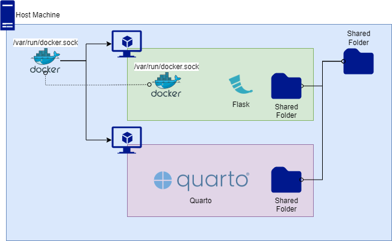

# `magdalena`

`magdalena` is a microservice to convert [Quarto](https://quarto.org/) documents into output formats such as HTML and PDF **for GESIS' MethodsHub**.

## Architecture Diagram

The host machine shares `/var/run/docker.sock` with the `magdalena` container (sometimes called Docker outside of Docker or Dood that should not be mistake by Docker in Docker or DinD). The container running [Quarto](https://quarto.org/) is a sibling container.

## Similar Software

- [`andrew`](https://github.com/GESIS-Methods-Hub/andrew)

## Frequently Asked Questions

#. Where the name `magdalena` comes from?

   This is a tribute to [Magdalena Morhart](https://en.wikipedia.org/wiki/Magdalena_Morhart).
