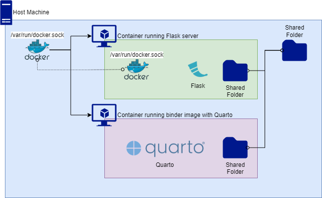

Architecture
============

Diagram
-------

   Diagram of magdalena

The host machine shares ``/var/run/docker.sock`` with the ``magdalena``
container (sometimes called Docker outside of Docker or Dood that should
not be mistake by Docker in Docker or DinD). The container running
`Quarto <https://quarto.org/>`__ is a sibling container.
